<p align="center">
  
</p>

<h1 align="center">🏆 Kaggle Competitions Portfolio</h1>

<p align="center">
  <strong>Real-world machine learning projects from Kaggle competitions</strong>
</p>

<p align="center">
  <a href="https://www.kaggle.com/dandrandandran2093"></a>
  <a href="https://tutkufurkan.com"></a>
  <a href="https://github.com/tutkufurkan"></a>
</p>

<p align="center">
  
  
  
  
  
</p>

---

## 📊 About This Repository

This repository showcases my journey through **Kaggle competitions**, featuring end-to-end machine learning projects with comprehensive documentation. Each project demonstrates practical applications of data science techniques, from exploratory data analysis to model deployment.

### 🎯 What You'll Find Here

- 🧪 **Real Competition Solutions** - Production-ready code for Kaggle challenges
- 📈 **Complete Workflows** - From data preprocessing to final predictions
- 🎨 **Interactive Visualizations** - Plotly-powered insights and analysis
- 📚 **Detailed Documentation** - Step-by-step explanations and learning outcomes
- 🚀 **Advanced Techniques** - Feature engineering, ensemble methods, hyperparameter tuning

---

## 🏆 Competition Projects

<table>
<tr>
<td width="50%" valign="top">

### 🚢 [Titanic Survival Prediction](./Titanic-Survival-Prediction)

<a href="./Titanic-Survival-Prediction">
  
</a>

**Competition:** [Titanic - Machine Learning from Disaster](https://www.kaggle.com/competitions/titanic)

**📓 Notebook:** [View on Kaggle](https://www.kaggle.com/code/dandrandandran2093/the-titanic-project)

#### 🎯 Performance
- **CV Score:** `0.8340 ± 0.0324`
- **Validation Accuracy:** `83.24%`
- **ROC-AUC:** `0.89+`

#### 🛠️ Techniques
- Advanced Feature Engineering (18+ features)
- Ensemble Learning (RF + XGBoost + GB)
- Aggressive Regularization
- 10-Fold Cross-Validation

#### 📦 Tech Stack


---

</td>
<td width="50%" valign="top">

### 🔜 More Competitions Coming Soon!

<div align="center">
  
  
  **Stay tuned for more exciting projects!**
  
  <br/>
  
  🎲 **House Prices Prediction**  
  🏥 **Healthcare Analytics**  
  💳 **Credit Card Fraud Detection**  
  📝 **NLP Text Classification**  
  
</div>

</td>
</tr>
</table>

---

## 📈 Competition Stats

<div align="center">

| Metric | Value |
|:------:|:-----:|
| 🏆 **Competitions Completed** | 1 |
| 📊 **Total Projects** | 1 |
| ⭐ **Best CV Score** | 0.8340 |
| 🎯 **Avg Accuracy** | 83%+ |

</div>

---

## 🎓 Learning Journey

### Skills Developed

<table>
<tr>
<td width="33%" valign="top">

#### 📊 Data Science
- Exploratory Data Analysis
- Feature Engineering
- Statistical Analysis
- Data Visualization
- Missing Data Handling

</td>
<td width="33%" valign="top">

#### 🤖 Machine Learning
- Classification & Regression
- Ensemble Methods
- Model Evaluation
- Cross-Validation
- Hyperparameter Tuning

</td>
<td width="33%" valign="top">

#### 🛠️ Tools & Libraries
- Python (NumPy, Pandas)
- Scikit-learn
- XGBoost & LightGBM
- Plotly & Seaborn
- Jupyter Notebooks

</td>
</tr>
</table>

---

## 🚀 Quick Start

### Option 1: Browse Projects
```bash
# Clone this repository
git clone https://github.com/tutkufurkan/Kaggle-Competitions.git

# Navigate to a project
cd Kaggle-Competitions/Titanic-Survival-Prediction

# Open the notebook
jupyter notebook the-titanic-project.ipynb
```

### Option 2: Run on Kaggle
Each project has a **"View on Kaggle"** button - click it to run the notebook directly on Kaggle with GPU support! 🚀

---

## 🔗 Related Projects

**My Machine Learning Educational Series:**

| Topic | Kaggle | GitHub |
|-------|--------|--------|
| 🎯 Classification Models | [Notebook](https://www.kaggle.com/code/dandrandandran2093/machine-learning-classifications-models) | [Repo](https://github.com/tutkufurkan/Machine-Learning---Classifications-Models) |
| 📈 Regression Models | [Notebook](https://www.kaggle.com/code/dandrandandran2093/machine-learning-regression-models) | [Repo](https://github.com/tutkufurkan/Machine-Learning---Regression-Models) |
| 🔍 Clustering Models | [Notebook](https://www.kaggle.com/code/dandrandandran2093/machine-learning-clustering-models) | [Repo](https://github.com/tutkufurkan/Machine-Learning---Clustering-Models) |
| 🚀 Advanced Topics | [Notebook](https://www.kaggle.com/code/dandrandandran2093/machine-learning-advanced-topics) | [Repo](https://github.com/tutkufurkan/Machine-Learning---Advanced-Topics) |

**Hub Repository:** [Machine Learning Series](https://github.com/tutkufurkan/Machine-Learning-Series)

---

## 📚 Methodology

Each competition project follows a structured approach:

```mermaid
graph LR
    A[Problem Understanding] --> B[EDA & Visualization]
    B --> C[Feature Engineering]
    C --> D[Model Selection]
    D --> E[Hyperparameter Tuning]
    E --> F[Ensemble & Evaluation]
    F --> G[Final Submission]
    
    style A fill:#e74c3c
    style B fill:#3498db
    style C fill:#f39c12
    style D fill:#9b59b6
    style E fill:#1abc9c
    style F fill:#2ecc71
    style G fill:#27ae60
```



---

## 💡 Key Principles

<table>
<tr>
<td align="center">

<br/><strong>Clean Code</strong>
<br/>Well-documented & reproducible
</td>
<td align="center">

<br/><strong>Best Practices</strong>
<br/>Industry-standard techniques
</td>
<td align="center">

<br/><strong>Educational</strong>
<br/>Detailed explanations
</td>
<td align="center">

<br/><strong>Production-Ready</strong>
<br/>Scalable solutions
</td>
</tr>
</table>

---

## 📄 License

All projects are licensed under the **Apache License 2.0** - see individual project LICENSE files for details.

---

## 📞 Connect With Me

<p align="center">
  <a href="https://www.kaggle.com/dandrandandran2093">
    
  </a>
  <a href="https://github.com/tutkufurkan">
    
  </a>
  <a href="https://tutkufurkan.com">
    
  </a>
  <a href="https://www.linkedin.com/in/tutkufurkan">
    
  </a>
</p>

---

<div align="center">

### ⭐ Star this repo if you find it helpful!

**Made with ❤️ and ☕ by [Tutku Furkan](https://tutkufurkan.com)**


</div>

---

<p align="center">
  <sub>🌐 <a href="https://tutkufurkan.com">tutkufurkan.com</a></sub>
</p>
